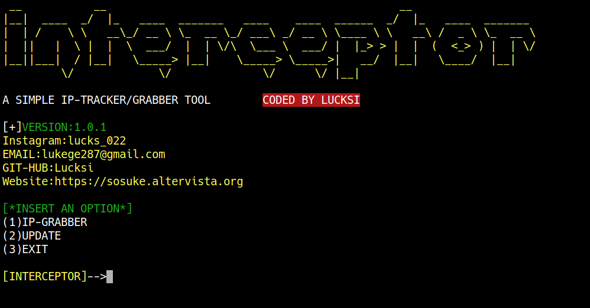

# INTERCEPTOR:

## INTRCEPTOR IS A SIMPLE IP-GRABBER, IT ALSO PROVIDE YOU SOME INFORMATION ABOUT THE IP. WITH THE HELP OF A LINK WITH A CUSTOM REDIRECT  

<br>

# DISCLAIMER
## THIS TOOL IS FOR EDUCATIONAL AND TESTING PURPOSES ONLY I DO NOT ASSUME ANY KIND OF RESPONSABILITY FOR ANY INTENTIONAL OR UNINTENTIONAL DAMAGE YOU WILL CAUSE WITH THIS TOOL, ATTACKS WITHOUT SOMEONE CONSENT IS CONSIDERATED ILLEGAL BY THE LAW.USE IT WITH GOOD SENSE 

<br>

# SCREENSHOT:


<br>

# INSTALLATION(LINUX):
```bash
git clone https://github.com/Lucksi/Interceptor
cd Interceptor
sudo chmod +x Installer.sh
sudo ./Installer.sh
```

<br>

# USAGE(LINUX):
```bash
sudo ./Interceptor.sh
```

<br>

# IF YOUR LINK DOESN'T SHOW UP TRY TO WRITE THIS COMMAND:
```bash
link=$(curl -s -N http://127.0.0.1:4040/api/tunnels | grep -o "https://[0-9a-z]*\.ngrok.io")
```
<br>

## <p align= center>MADE WITH :heart: BY LUCKSI IN :it:</p>
